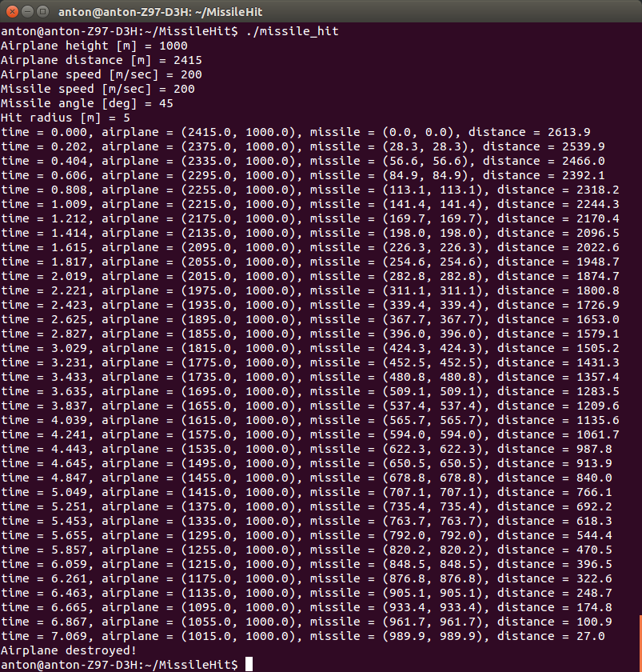

# MissileHit

**Входные данные:**
- высота самолета в метрах
- расстояние от самолета до ракеты в горизонатльной плоскоти в метрах
- скорость самолета в метрах в секунду
- скорость ракеты в метрах в секунду
- угол наклона ракеты к земле в градусах
- радиус срабатывания ракеты в метрах

**Выходные данные:**
- время
- координаты самолета
- координаты ракеты
- расстояние между самолетом и ракетой
- факт попадания или невозможности попадания

